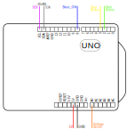

# DE2 Measuring electricity project

### Team members

* Christopher Koiš  (Code)
* Jan Gadas (18650 Discharging circuit)
* Jan Čipl (Documentation)
* Vojtěch Drtina (Documentation)

## Theoretical description and explanation

We decided to construct user friendly 18650 battery tester. We can measure voltage, current, capacity in mAh, energy in mWh and DC internal resistance. These values are shown on the OLED display. The whole application is controlled by 2 buttons. And results are shown automatically after the measurement concludes.

## Hardware description of demo application
**Schematic of Arduino.**

  

We used 2 buttons connected to digital pins PD2 and PD3. The green one starts measurement and the red is used to pause the measurement. 
OLED is connected to `SDA` and `SCL` pins. 
Our discharge circuit is connected to `PD8` and Analog pins `A0`.  

&nbsp;

**Schematic of battery discharging circuit.**

  

The discharging circuit consists of a IRF8010 MOSFET as a switch that is controlled by a BC557 BJT. The base of the BJT is connected via 10 kΩ resistor to the `PB0` digital pin. The circuit resistance has to be measured separately, as we are using only a single analog pin for voltage measurement. The battery capacity measurement is slightly skewed, because of how we measure internal resistance of the cell, which is calculated 3 seconds after the measurement is started `R_bat = (Voltage_unloaded - Voltage_dropped) / Current`

## Software description

  

## Instructions

You firts need to insert 18650 lion battery to the holder shown in the picture.
## fotka holderu
Then you can check volatage of battery and if its suitable for measurement.\
4,2 - 4,1V battery is fully charged \
3,7 battery is halfway charged \
<2,5V battery is discharged 
If its suitable then you can press the green button to start measuiring the battery.
## fotka zeleného tlačítka
After few second an internal resistence is shown on display. All of the other variables are shown through the measurement.
## fotka displeje s popisky
After the measurement is finished it will shown on screen.
## fotka measurement is finished

## References

1. [Atmega328 datasheet](https://ww1.microchip.com/downloads/aemDocuments/documents/MCU08/ProductDocuments/DataSheets/40001906C.pdf)
2. ...

https://guides.github.com/features/mastering-markdown/