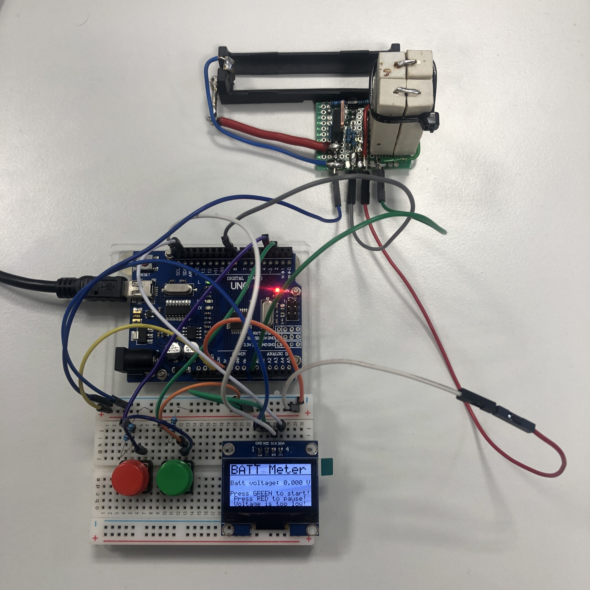
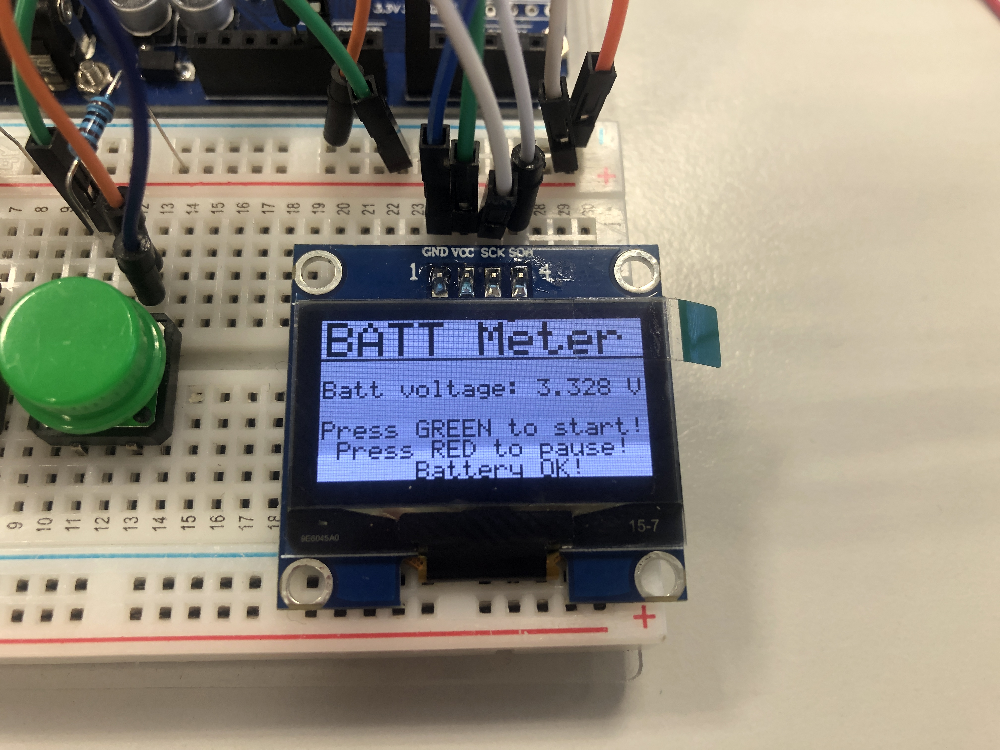
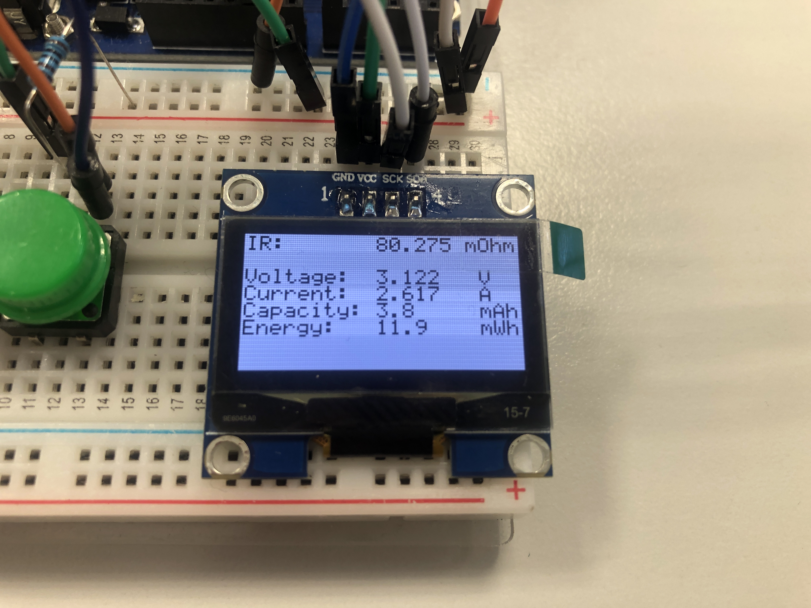
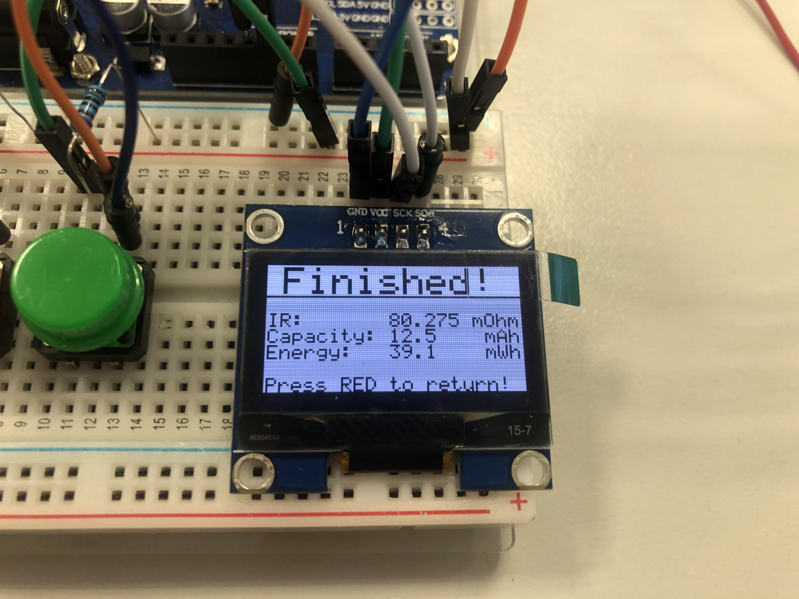

# DE2 Measuring electricity project

<p align="center">
  
</p>


### Team members

* Christopher Koiš  (Code)
* Jan Gadas (18650 Discharging circuit)
* Jan Čipl (Documentation)
* Vojtěch Drtina (Documentation)

## Theoretical description and explanation

We decided to construct user friendly 18650 battery tester. We can measure voltage, current, capacity in mAh, energy in mWh and DC internal resistance. These values are shown on the OLED display. The whole application is controlled by 2 buttons. Clocking the measurement of battery voltage once every second, one can simply calculate the other quantities by adding the increments together every second. This accumulates the capacity and energy values and the results are shown automatically after the measurement concludes.

## Hardware description of demo application
**Schematic of Arduino UNO board**
<p align="center">
  
</p>

We used 2 buttons connected to digital pins `PD2` (Start button) and `PD3` (Pause/Stop button). The green one starts measurement and the red is used to pause the measurement. OLED display is connected to `SDA` and `SCL` pins. Our discharging circuit is connected to `PD8` and Analog pins `A0`.  

**Schematic of battery discharging circuit**
<p align="center">
  
</p>

The discharging circuit consists of a IRF8010 MOSFET as a switch that is controlled by a BC557 BJT. The base of the BJT is connected via 10 kΩ resistor to the `PB0` digital pin. The circuit resistance has to be measured separately, as we are using only a single analog pin for voltage measurement. 

The battery capacity measurement is slightly skewed, because of how we measure internal resistance of the cell, which is calculated 3 seconds after the measurement is started. This approach is **not** the most accurate, but very simple and requires no muxing of the ADC inputs which could lead to timing inconsistencies.

## Software description

<p align="center">
  
</p>

The internal ADC of the Atmega328 is used for voltage measurement. In the initialization phase, registers are set accordingly: 

[Tabulka s hodnotami registrov]: #

``` c
 // Select ADC voltage reference to "AVcc with external capacitor at AREF pin"
ADMUX |= (1 << REFS0);
// Select input channel ADC0 (voltage divider pin)
ADMUX &= ~(1 << MUX3 | 1 << MUX2 | 1 << MUX1 | 1 << MUX0);
// Enable ADC module
ADCSRA |= (1 << ADEN);
// Enable conversion complete interrupt
ADCSRA |= (1 << ADIE);
// Set clock prescaler to 128
ADCSRA = ADCSRA | (1 << ADPS2 | 1 << ADPS1 | 1 << ADPS0);
```
`R_bat = (Voltage_unloaded - Voltage_dropped) / Current`


## Instructions

1. Insert a 18650 Li-ion cell into the holder shown in the picture.
<p align="center">
  
</p>

Then you can check volatage of battery and if its suitable for measurement.

- 4,2 - 4,1V battery is fully charged
- 3,7 battery is charged halfway
- <2,5V battery is discharged

&nbsp;

2. If it's suitable you can press the <font color="green">green button</font> to start the measurement. 
<p align="center">
  
</p>

3. After few second an internal resistence is shown on display. Other values are shown throughout the measurement.
<p align="center">
  
</p>

4. After the measurement is finished, the values are shown on the display.
<p align="center">
  
</p>

## Demonstration

[](https://www.youtube.com/watch?v=g1Zs0lZ0VUw)

## References

1. [Atmega328 datasheet](https://ww1.microchip.com/downloads/aemDocuments/documents/MCU08/ProductDocuments/DataSheets/40001906C.pdf)
2. [Markdown Guide](https://www.markdownguide.org/)