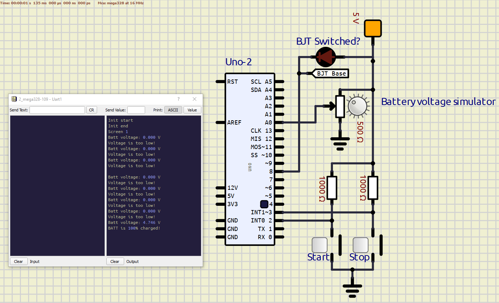
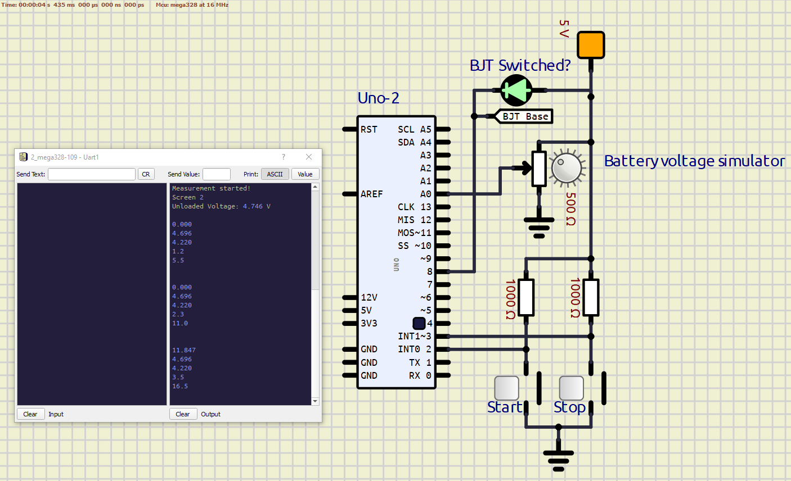
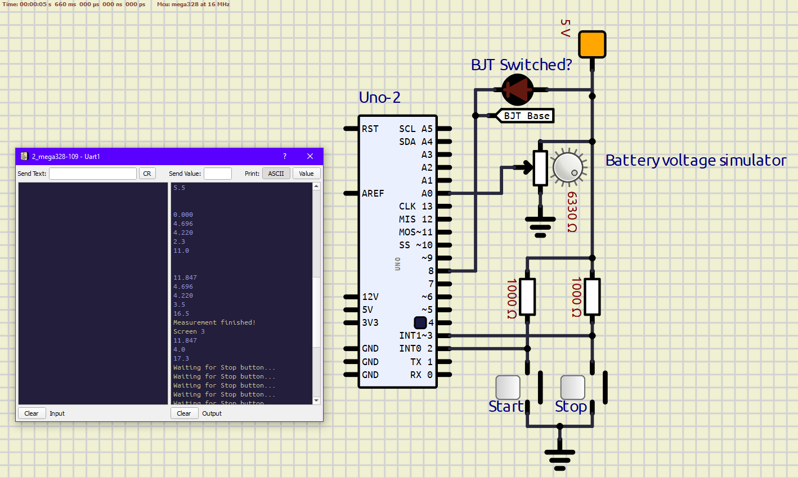
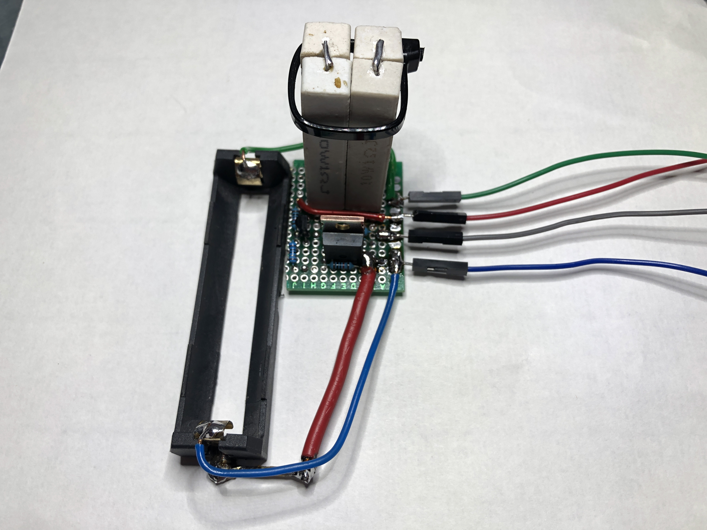

# DE2 Measuring electricity project

<p align="center">
  
</p>


### Team members

* Christopher Koiš  (Code)
* Jan Gadas (18650 Discharging circuit)
* Jan Čipl (Documentation)
* Vojtěch Drtina (Documentation)

## Theoretical description and explanation

We decided to construct user friendly 18650 battery tester. We can measure voltage, current, capacity in mAh, energy in mWh and DC internal resistance. These values are shown on the OLED display. The whole application is controlled by 2 buttons. Clocking the measurement of battery voltage once every second, one can simply calculate the other quantities by adding the increments together every second. This accumulates the capacity and energy values and the results are shown automatically after the measurement concludes.

## Hardware description of demo application
### Schematic of Arduino UNO board
<p align="center">
  
</p>

We used 2 buttons connected to digital pins `PD2` (Start button) and `PD3` (Pause/Stop button). The green one starts measurement and the red is used to pause the measurement. OLED display is connected to `SDA` and `SCL` pins. Our discharging circuit is connected to `PD8` and Analog pins `A0`.  

### Schematic of battery discharging circuit
<p align="center">
  
</p>

The discharging circuit consists of a IRF8010 MOSFET as a switch that is controlled by a BC557 BJT. The base of the BJT is connected via 10 kΩ resistor to the `PB0` digital pin. The circuit resistance has to be measured separately, as we are using only a single analog pin for voltage measurement. 

The battery capacity measurement is slightly skewed, because of how we measure internal resistance of the cell, which is calculated 3 seconds after the measurement is started. This approach is **not** the most accurate, but very simple and requires no muxing of the ADC inputs which could lead to timing inconsistencies.

### SimulIDE circuit
Some screenshots of the Arduino board side circuit with UART console open.

**The program is waiting for user input**

<p align="center">
  
</p>

**Measurement started**

<p align="center">
  
</p>

**Measurement finished, notice the potentiometer slider position**

<p align="center">
  
</p>

## Software description

<p align="center">
  
</p>

The internal ADC of the Atmega328 is used for voltage measurement. In the initialization phase, registers are set accordingly: 

| Register    | Address     | Function |
|    :----:   |    :----    |  :----   |
| ADMUX       | `REFS0 = 1` <br> `MUX[3:0] = 0` | Set ADC voltage reference to internal AVcc <br> Select ADC input channel to ADC0, pin `A0`
| ADSRA       | `ADEN = 1` <br> `ADIE = 1` <br> `ADPS[2:0] = 1` | Enable ADC module <br> Enable conversion complete interrupt <br> Set clock prescaler to 128

``` c
 // Select ADC voltage reference to "AVcc with external capacitor at AREF pin"
ADMUX |= (1 << REFS0);
// Select input channel ADC0 (voltage divider pin)
ADMUX &= ~(1 << MUX3 | 1 << MUX2 | 1 << MUX1 | 1 << MUX0);
// Enable ADC module
ADCSRA |= (1 << ADEN);
// Enable conversion complete interrupt
ADCSRA |= (1 << ADIE);
// Set clock prescaler to 128
ADCSRA |= (1 << ADPS2 | 1 << ADPS1 | 1 << ADPS0);
```

Using the Timer1 and its overflow Interrupt Service Routine, the `TIM1_OVF_CNT` global variable is incremented by 1 every 1,049 seconds. This makes for a 1 second clock signal that can be used later. <br>
ADC converted data is stored inside `ADC_A0` global variable and normalized by its maximum value: 1023, it is then multiplied by the reference voltage, which can be set manually by editing the variable `Vref`. Default value is 5.

``` c
ISR(ADC_vect)
{
    static uint8_t Vref = 5;      // Voltage reference for normalization in ADC ISR
    ADC_A0 = Vref * ADC / 1023.0; // ADC channel ADC0
}
```

The current measurement is done through calculation. The result is slightly higher during the first 3 seconds of the measurement due to `R_bat` being equal to `0.0`.

``` c
Current = Voltage / fabs(R_circ + R_bat);
```

The internal resistance is calculated 3 seconds after the measurement is started, so that the battery experiences a voltage drop. The `if` condition is there to ensure that the internal resistance is calculated only once. The `Voltage_dropped` variable stores a snapshot of the current voltage.

``` c
if ((TIM1_OVF_CNT == 3) & (R_bat == 0)) // If time == 3sec, measure dropped voltage
{
  Voltage_dropped = Voltage;
  R_bat = (Voltage_unloaded - Voltage_dropped) / Current;
}
```

Capacity (not to be confused with capacitance) is incremented every second and calculated from the discharge current. The increments are in [mAs] and are converted to [mAh] once they are cumulatively added. Same goes for energy, which is in [mWh]. It is calculated similarly as capacity, but multiplied by `Voltage` since `P = U·I`.

``` c
Capacity_increment = (1000 * Current);             // [mAs]
Capacity = Capacity + (Capacity_increment / 3600); // [mAh]

Energy_increment = Capacity_increment * Voltage; // [mWs]
Energy = Energy + (Energy_increment / 3600);     // [mWh]

```

During the measurement the electrical quantities are shown on the display and updated every second. The `oled_puts();` function is required in order to write a string into the OLED RAM. We write a lot into that RAM and usually specify the exact spot on the display. For that we have devised a simple function that accepts values of variables. It also sends that string via UART for debugging purposes.

``` c
void batterymeter_write_var(unsigned int x, unsigned int y, float value, char* string)
{
    char strOut[32];

    sprintf(strOut, string, value);
    oled_gotoxy(x,y);   oled_puts(strOut);

    uart_puts(strOut);
    uart_puts("\r\n");

}
```

## Instructions

1. Insert a 18650 Li-ion cell into the holder shown in the picture.
<p align="center">
  
</p>

Then you can check volatage of battery and if its suitable for measurement.

| Voltage [V]    | Status      |
|    ----:   |    :----    |
| 4,2 ~ 4,1 | Battery is fully charged |
| 3,7 | Battery is charged halfway |
| <2,5 | Battery is discharged |

&nbsp;

2. If it's suitable you can press the green button to start the measurement. 
<p align="center">
  
</p>

3. After few seconds the internal resistence is shown on the display. Other values are shown throughout the whole measurement.
<p align="center">
  
</p>

4. After the measurement is finished, the values are shown on the display.
<p align="center">
  
</p>

## Demonstration

[](https://www.youtube.com/watch?v=g1Zs0lZ0VUw)


## References

1. [Atmega328 datasheet](https://ww1.microchip.com/downloads/aemDocuments/documents/MCU08/ProductDocuments/DataSheets/40001906C.pdf)
2. [DE2 Course Repository](https://github.com/tomas-fryza/digital-electronics-2)
3. [Markdown Guide](https://www.markdownguide.org/)